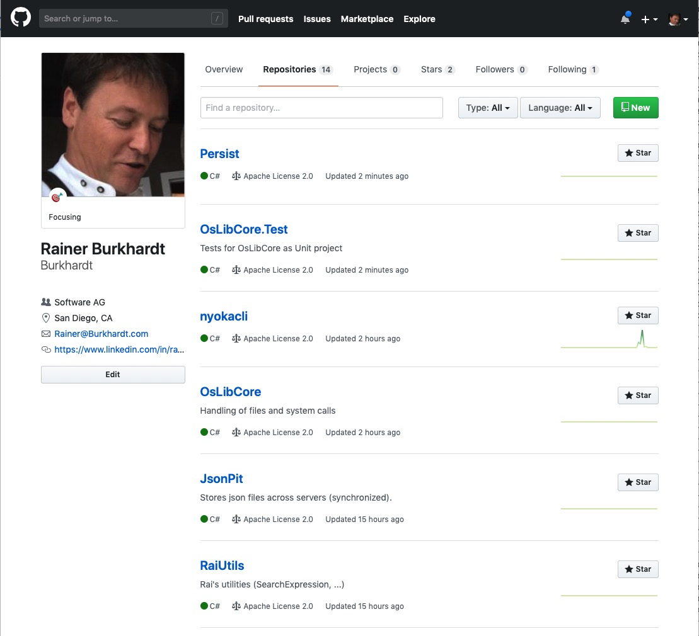
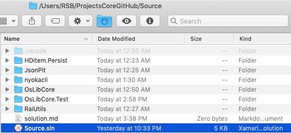
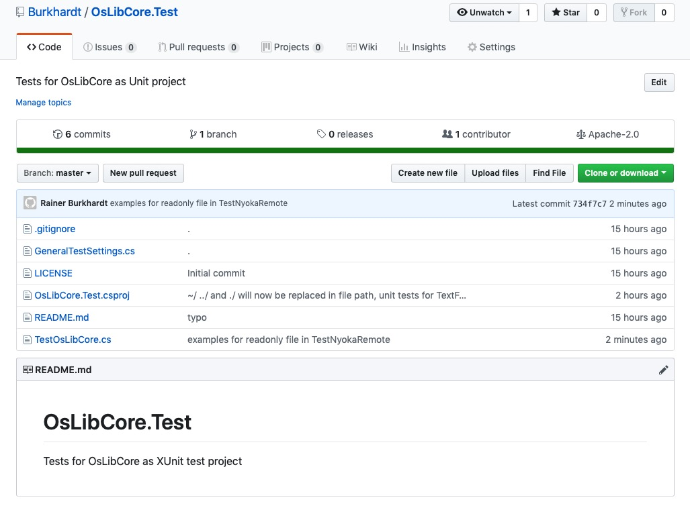
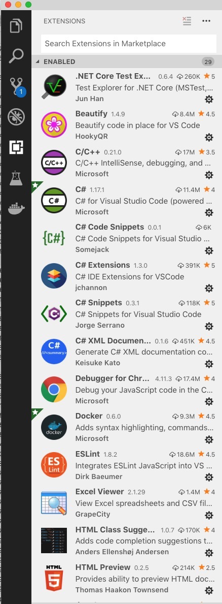
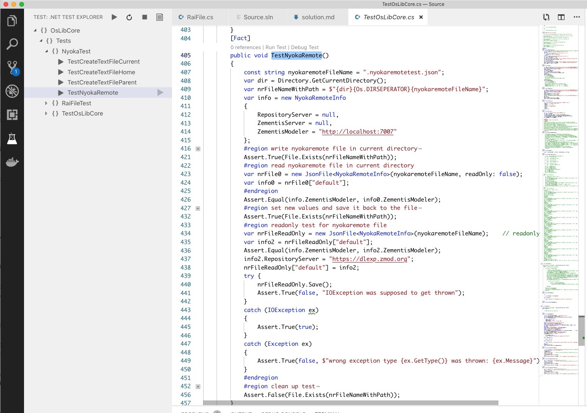

# Setup 6 projects

This is my recommendation for a test-first solution setup using these projects:

    mkdir ~/ProjectsCoreGitHub/Source
    cd ~/ProjectsCoreGitHub/Source
    git clone https://github.com/Burkhardt/Persist.git
    git clone https://github.com/Burkhardt/RaiCore.Test.git
    git clone https://github.com/Burkhardt/nyokacli.git
    git clone https://github.com/Burkhardt/OsLib.git
    git clone https://github.com/Burkhardt/JsonPit.git
    git clone https://github.com/Burkhardt/RaiUtils.git

Now we have 6 projects in subdirectories.

Create a solution

    dotnet new sln

Creates a solution file - it's empty yet.

    dotnet sln add Persist
    dotnet sln add JsonPit
    dotnet sln add nyokacli
    dotnet sln add OsLib
    dotnet sln add RaiCore.Test
    dotnet sln add RaiUtils

The use of JsonFile for `.nyokaremote.json` is shown in a unit test:

Start VS Code

    code .

Make sure you have the necessary plugins

    * .NET Core Test Explorer
    * C#
    * C# XML Documentation
    * Docker (for later)

Switch to Test Explorer

Now you can start any unit test on the vright side via `Debug Test` or on the left side tapping the run button in the test explorer.
